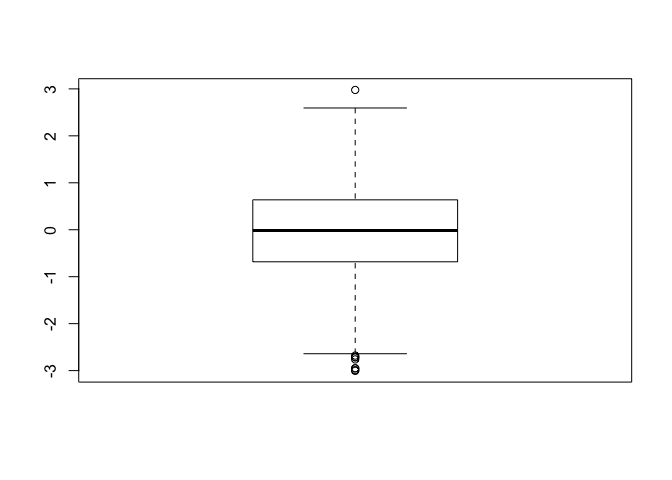
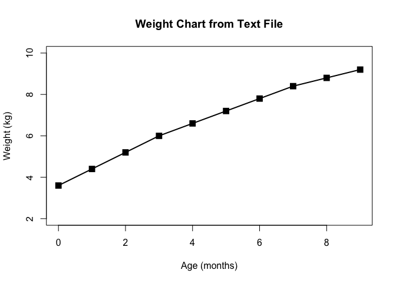
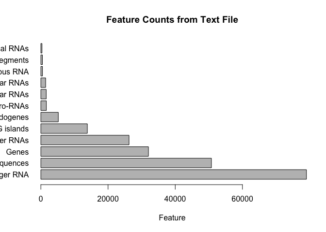
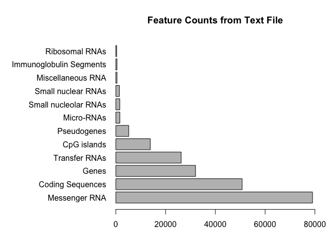
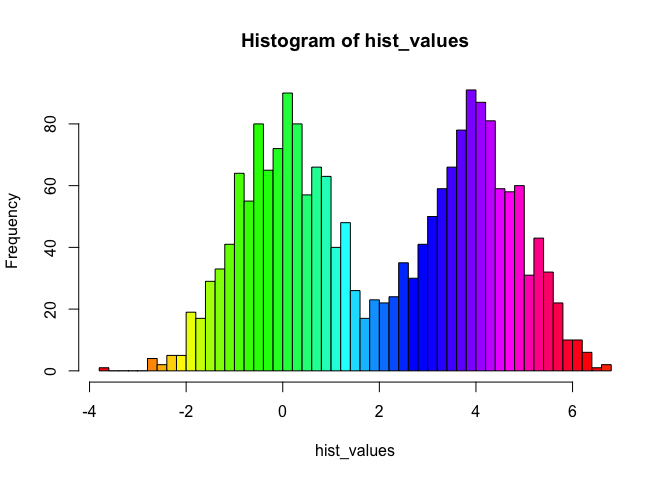
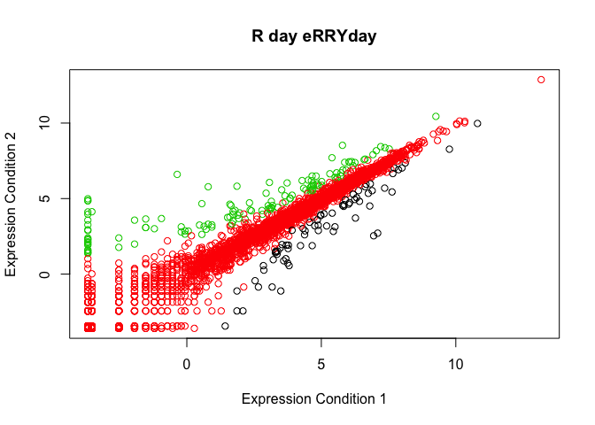

class05
================
julien
20190124

``` r
#Class 05 R graphics intro

#My frirst boxplot

#?rnorm or help(rnorm) to learn about normal distribution
x <- rnorm(1000,0)
boxplot(x)
```



I have generated **bold** x **italics** and it has **r code(x)**

``` r
# summary(x)
# hist(x)
# ?boxplot
# boxplot(x, horizontal = TRUE)
# ?read.table

weight <- read.table("bimm143_05_rstats/weight_chart.txt", header=TRUE)
plot(weight, type="o", pch=15, cex=1.5, lwd=2, ylim=c(2,10), xlab="Age (months)", ylab="Weight (kg)", main="Weight Chart from Text File")
```



``` r
features <- read.table("bimm143_05_rstats/feature_counts.txt", sep = "\t", header = TRUE)
features
```

    ##                    Feature Count
    ## 1            Messenger RNA 79049
    ## 2         Coding Sequences 50770
    ## 3                    Genes 32029
    ## 4            Transfer RNAs 26248
    ## 5              CpG islands 13840
    ## 6              Pseudogenes  5195
    ## 7               Micro-RNAs  1638
    ## 8     Small nucleolar RNAs  1602
    ## 9       Small nuclear RNAs  1431
    ## 10       Miscellaneous RNA   491
    ## 11 Immunoglobulin Segments   474
    ## 12          Ribosomal RNAs   341

``` r
barplot(features$Count, names.arg = features$Feature, xlab = "Feature", horiz = TRUE, las=1, mar=c(1,1,1,1), main = "Feature Counts from Text File")
```



``` r
#margin parameters need to be done by guess and check
par(mar=c(3.1, 12.1, 4.1, 2.1))
barplot(features$Count, names.arg = features$Feature, xlab = "Feature", horiz = TRUE, las=1, main = "Feature Counts from Text File", xlim = c(0,80000))
```



``` r
#2C: Histograms
hist_values <- c(rnorm(1000), rnorm(1000)+4)
par(mar=c(5,4,4,2)+0.1)
hist(hist_values, breaks=50, col = rainbow(50))
```



``` r
#3B Coloring by Value
updown <- read.table("bimm143_05_rstats/up_down_expression.txt", sep = "\t", header = TRUE)
# updown
table(updown$State)
```

    ## 
    ##       down unchanging         up 
    ##         72       4997        127

``` r
par(mar=c(5,4,4,2)+0.1)
plot(updown$Condition1, updown$Condition2, col = updown$State, xlab = "Expression Condition 1", ylab = "Expression Condition 2", main = "R day eRRYday")
```



``` r
levels(updown$State)
```

    ## [1] "down"       "unchanging" "up"

``` r
palette(c("blue", "gray", "red"))
```
