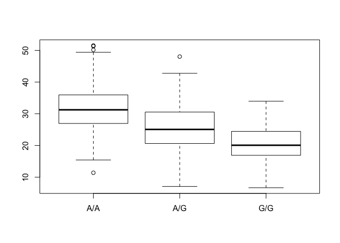

class14\_markdown
================

Asthma SNPs in MXL Population
-----------------------------

Read file from Ensemble

<http://uswest.ensembl.org/Homo_sapiens/Variation/Sample?db=core;r=17:39894595-39895595;v=rs8067378;vdb=variation;vf=362656008#373531_tablePanel>

``` r
mxl.data <- read.csv("373531-SampleGenotypes-Homo_sapiens_Variation_Sample_rs8067378.csv")
```

Use table function to count how many of each genotypes

``` r
mxl.genotypes <- table(mxl.data$Genotype..forward.strand.)
## if want to count specific one can also do following
## sum(mxl.data$Genotype..forward.strand.=="G|G")
```

Percent values

``` r
mxl.genotypes / nrow(mxl.data) *100
```

    ## 
    ##     A|A     A|G     G|A     G|G 
    ## 34.3750 32.8125 18.7500 14.0625

FASTQ quality scores

Q. Does the first sequence have good quality

``` r
q <- "DDDDCDEDCDDDDBBDDDCC@"
library(seqinr)
library(gtools)

asc(s2c(q)) -33
```

    ##  D  D  D  D  C  D  E  D  C  D  D  D  D  B  B  D  D  D  C  C  @ 
    ## 35 35 35 35 34 35 36 35 34 35 35 35 35 33 33 35 35 35 34 34 31

``` r
## 33 is the offset for the specific ASCII range in sequencing
```

Importing file for Population Scale Analysis

``` r
expression.data <- read.csv("rs8067378_ENSG00000172057.6.txt", sep = " ")
```

``` r
summary(expression.data)
```

    ##      sample     geno          exp        
    ##  HG00096:  1   A/A:108   Min.   : 6.675  
    ##  HG00097:  1   A/G:233   1st Qu.:20.004  
    ##  HG00099:  1   G/G:121   Median :25.116  
    ##  HG00100:  1             Mean   :25.640  
    ##  HG00101:  1             3rd Qu.:30.779  
    ##  HG00102:  1             Max.   :51.518  
    ##  (Other):456

``` r
inds.gg <-expression.data$geno =="G/G"
summary(expression.data$exp[inds.gg])
```

    ##    Min. 1st Qu.  Median    Mean 3rd Qu.    Max. 
    ##   6.675  16.900  20.070  20.590  24.460  33.960

``` r
inds.aa <-expression.data$geno =="A/A"
summary(expression.data$exp[inds.aa])
```

    ##    Min. 1st Qu.  Median    Mean 3rd Qu.    Max. 
    ##   11.40   27.02   31.25   31.82   35.92   51.52

``` r
inds.ag <-expression.data$geno =="A/G"
summary(expression.data$exp[inds.ag])
```

    ##    Min. 1st Qu.  Median    Mean 3rd Qu.    Max. 
    ##   7.075  20.630  25.060  25.400  30.550  48.030

Figure that would show distributon

``` r
boxplot(exp ~ geno, expression.data)
```


