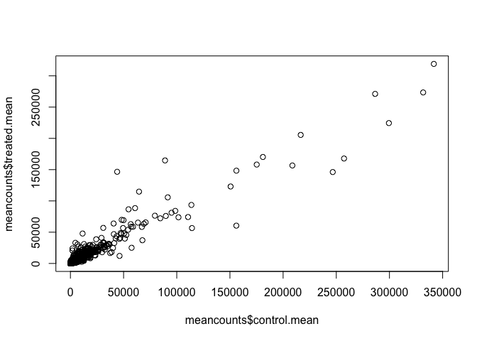
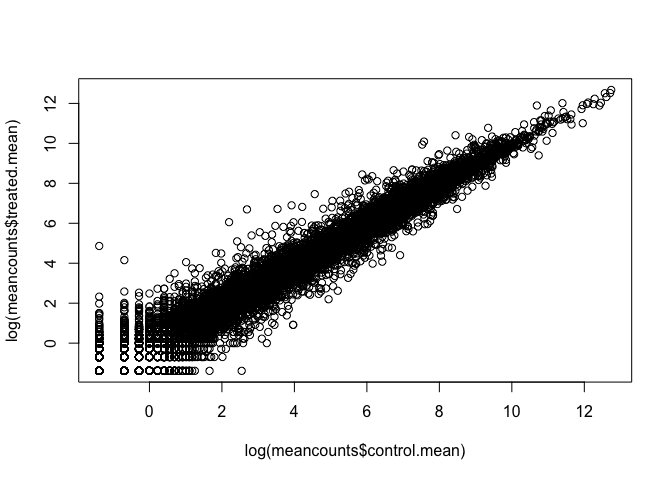
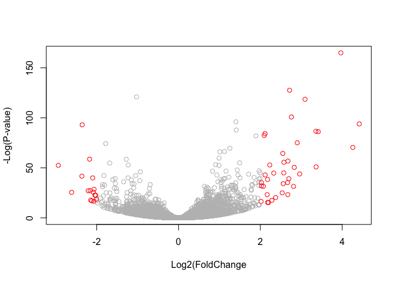

class15\_markdown
================

GitHub Documents
----------------

Install DESeq2 from bioconductor Say no when asks if want to install from source or update

``` r
## Copy paste into console one at a time
##source("http://bioconductor.org/biocLite.R")
##biocLite()

# For this class, you'll also need DESeq2:
##biocLite("DESeq2")
```

Run from library

``` r
library(BiocInstaller)
```

    ## Bioconductor version 3.4 (BiocInstaller 1.24.0), ?biocLite for help

    ## A new version of Bioconductor is available after installing the most
    ##   recent version of R; see http://bioconductor.org/install

Read the csv files count and metadata files

``` r
counts <- read.csv("data/airway_scaledcounts.csv", stringsAsFactors = FALSE)
metadata <-  read.csv("data/airway_metadata.csv", stringsAsFactors = FALSE)
```

understand the data by looking at the heads

``` r
# head(counts)
# head(metadata)
# dim(counts)
# dim(metadata)
```

matches except that have ensemble gene name in first column

want to check if columns match rows

``` r
colnames(counts)
```

    ## [1] "ensgene"    "SRR1039508" "SRR1039509" "SRR1039512" "SRR1039513"
    ## [6] "SRR1039516" "SRR1039517" "SRR1039520" "SRR1039521"

``` r
metadata$id
```

    ## [1] "SRR1039508" "SRR1039509" "SRR1039512" "SRR1039513" "SRR1039516"
    ## [6] "SRR1039517" "SRR1039520" "SRR1039521"

``` r
colnames(counts)[-1] == metadata$id
```

    ## [1] TRUE TRUE TRUE TRUE TRUE TRUE TRUE TRUE

``` r
#use all to check all cases and return single function
all(colnames(counts)[-1] == metadata$id)
```

    ## [1] TRUE

First task is find which columns in counts correstponds to control conditions (i.e. no drug). Then calculate average count value for each gene.

``` r
control.inds <- metadata$dex == "control"
# use ID to look up columns and use rownames to match
control.ids <- metadata$id[control.inds]
head(counts[,control.ids])
```

    ##   SRR1039508 SRR1039512 SRR1039516 SRR1039520
    ## 1        723        904       1170        806
    ## 2          0          0          0          0
    ## 3        467        616        582        417
    ## 4        347        364        318        330
    ## 5         96         73        118        102
    ## 6          0          1          2          0

Calculate average of each row

``` r
control.mean <- rowSums(counts[,control.ids]) / ncol(counts[,control.ids])
names(control.mean) <- counts$ensgene
```

Now do same for drug treated columns

``` r
treated.inds <- metadata$dex == "treated"
treated.ids  <- metadata$id[treated.inds]
treated.mean <- rowSums(counts[,treated.ids]) / ncol(counts[,treated.ids])
names(treated.mean) <- counts$ensgene
```

Combine meancount to make it cleaner

``` r
meancounts <- data.frame(control.mean, treated.mean)
```

Sum instances

``` r
colSums(meancounts)
```

    ## control.mean treated.mean 
    ##     23005324     22196524

Plot treated vs control. If no RMSE then perfect correlation, if scatter then other factors may be related

``` r
plot(meancounts$control.mean, meancounts$treated.mean)
```



Because a bunch of values very small, better to show as a logarithm plot

``` r
plot(log(meancounts$control.mean), log(meancounts$treated.mean))
```



``` r
# or can do
# plot(meancounts$control.mean, meancounts$treated.mean, log = "xy")
```

Log2 is usually used because it has nice properties Creates another column in meancounts that has log comparitive properties 0 is on line, + is above, - is below (above means gene expression goes up)

``` r
meancounts$log2fc <- log2(meancounts[,"treated.mean"]/meancounts[,"control.mean"])
head(meancounts)
```

    ##                 control.mean treated.mean      log2fc
    ## ENSG00000000003       900.75       658.00 -0.45303916
    ## ENSG00000000005         0.00         0.00         NaN
    ## ENSG00000000419       520.50       546.00  0.06900279
    ## ENSG00000000457       339.75       316.50 -0.10226805
    ## ENSG00000000460        97.25        78.75 -0.30441833
    ## ENSG00000000938         0.75         0.00        -Inf

Nan = log(x/0) -inf = log(0) want to filter out these odd values, if zeroes then no data on gene arr.ind retuns array row and column of instance unique filters out duplicates

``` r
zero.vals <- which(meancounts[,1:2]==0, arr.ind=TRUE)
to.remove <- unique(zero.vals[,1])
mycounts <- meancounts[-to.remove,]
```

Create common threshold to determine whether data "different." Using -2 and 2

``` r
up.ind <- mycounts$log2fc > 2
down.ind <- mycounts$log2fc < (-2)
```

Use sum to get amount of up and down

``` r
sum(up.ind)
```

    ## [1] 250

``` r
sum(down.ind)
```

    ## [1] 367

There are `sum(up.ind)` up regulated genes and `sum(down.ind)` down regualated genes.

Show up regulated genes

``` r
head(mycounts[up.ind,])
```

    ##                 control.mean treated.mean   log2fc
    ## ENSG00000004799       270.50      1429.25 2.401558
    ## ENSG00000006788         2.75        19.75 2.844349
    ## ENSG00000008438         0.50         2.75 2.459432
    ## ENSG00000011677         0.50         2.25 2.169925
    ## ENSG00000015413         0.50         3.00 2.584963
    ## ENSG00000015592         0.50         2.25 2.169925

Problem is do not what know proteins are being mentioned

Use merge function to combine annotation data with regulated data use head to get idea of annotation.data

``` r
annotation.data <- read.csv("data/annotables_grch38.csv")
# head(annotation.data)
mycounts.annotated <- merge(mycounts, annotation.data, by.x = "row.names", by.y = "ensgene")
# head(mycounts.annotated)
```

Save time and work efficiently by using the DESeq2 analysis

``` r
library(DESeq2)
```

    ## Loading required package: S4Vectors

    ## Loading required package: stats4

    ## Loading required package: BiocGenerics

    ## Loading required package: parallel

    ## 
    ## Attaching package: 'BiocGenerics'

    ## The following objects are masked from 'package:parallel':
    ## 
    ##     clusterApply, clusterApplyLB, clusterCall, clusterEvalQ,
    ##     clusterExport, clusterMap, parApply, parCapply, parLapply,
    ##     parLapplyLB, parRapply, parSapply, parSapplyLB

    ## The following objects are masked from 'package:stats':
    ## 
    ##     IQR, mad, xtabs

    ## The following objects are masked from 'package:base':
    ## 
    ##     anyDuplicated, append, as.data.frame, cbind, colnames,
    ##     do.call, duplicated, eval, evalq, Filter, Find, get, grep,
    ##     grepl, intersect, is.unsorted, lapply, lengths, Map, mapply,
    ##     match, mget, order, paste, pmax, pmax.int, pmin, pmin.int,
    ##     Position, rank, rbind, Reduce, rownames, sapply, setdiff,
    ##     sort, table, tapply, union, unique, unsplit, which, which.max,
    ##     which.min

    ## 
    ## Attaching package: 'S4Vectors'

    ## The following objects are masked from 'package:base':
    ## 
    ##     colMeans, colSums, expand.grid, rowMeans, rowSums

    ## Loading required package: IRanges

    ## Loading required package: GenomicRanges

    ## Loading required package: GenomeInfoDb

    ## Loading required package: SummarizedExperiment

    ## Loading required package: Biobase

    ## Welcome to Bioconductor
    ## 
    ##     Vignettes contain introductory material; view with
    ##     'browseVignettes()'. To cite Bioconductor, see
    ##     'citation("Biobase")', and for packages 'citation("pkgname")'.

``` r
citation("DESeq2")
```

    ## 
    ##   Michael I Love, Wolfgang Huber and Simon Anders (2014):
    ##   Moderated estimation of fold change and dispersion for RNA-Seq
    ##   data with DESeq2. Genome Biology
    ## 
    ## A BibTeX entry for LaTeX users is
    ## 
    ##   @Article{,
    ##     title = {Moderated estimation of fold change and dispersion for RNA-seq data with DESeq2},
    ##     author = {Michael I Love and Wolfgang Huber and Simon Anders},
    ##     year = {2014},
    ##     journal = {Genome Biology},
    ##     doi = {10.1186/s13059-014-0550-8},
    ##     volume = {15},
    ##     issue = {12},
    ##     pages = {550},
    ##   }

Need to populate w count data, metadata, and formula for experiment design

``` r
dds <- DESeqDataSetFromMatrix(countData=counts, 
                              colData=metadata, 
                              design=~dex, 
                              tidy=TRUE)
```

    ## converting counts to integer mode

    ## Warning in DESeqDataSet(se, design = design, ignoreRank): some variables in
    ## design formula are characters, converting to factors

``` r
dds
```

    ## class: DESeqDataSet 
    ## dim: 38694 8 
    ## metadata(1): version
    ## assays(1): counts
    ## rownames(38694): ENSG00000000003 ENSG00000000005 ...
    ##   ENSG00000283120 ENSG00000283123
    ## rowData names(0):
    ## colnames(8): SRR1039508 SRR1039509 ... SRR1039520 SRR1039521
    ## colData names(4): id dex celltype geo_id

Want to run function will but but then need to get results and data

``` r
dds.return <- DESeq(dds)
```

    ## estimating size factors

    ## estimating dispersions

    ## gene-wise dispersion estimates

    ## mean-dispersion relationship

    ## final dispersion estimates

    ## fitting model and testing

``` r
dds.results <- results(dds.return)
summary(dds.results)
```

    ## 
    ## out of 25258 with nonzero total read count
    ## adjusted p-value < 0.1
    ## LFC > 0 (up)     : 1560, 6.2% 
    ## LFC < 0 (down)   : 1189, 4.7% 
    ## outliers [1]     : 212, 0.84% 
    ## low counts [2]   : 9918, 39% 
    ## (mean count < 10)
    ## [1] see 'cooksCutoff' argument of ?results
    ## [2] see 'independentFiltering' argument of ?results

Volcano plot: significantly regulated gense vs. fold change shows fold change (x-axis) vs. p-value

Order results by smallest p-value

``` r
resOrdered <- dds.results[order(dds.results$pvalue),]
```

Change p-value cutoff to 0.05 instead of default 0.1

``` r
res05 <- results(dds.return, alpha=0.05)
res01 <- results(dds.return, alpha=0.01)
summary(res05)
```

    ## 
    ## out of 25258 with nonzero total read count
    ## adjusted p-value < 0.05
    ## LFC > 0 (up)     : 1232, 4.9% 
    ## LFC < 0 (down)   : 932, 3.7% 
    ## outliers [1]     : 212, 0.84% 
    ## low counts [2]   : 8993, 36% 
    ## (mean count < 6)
    ## [1] see 'cooksCutoff' argument of ?results
    ## [2] see 'independentFiltering' argument of ?results

More generic way of accessing acutal subset of data framce

``` r
resSig05 <- subset(as.data.frame(dds.results), padj < 0.05)
nrow(resSig05)
```

    ## [1] 2179

``` r
resSig01 <- subset(as.data.frame(dds.results), padj < 0.01)
nrow(resSig01)
```

    ## [1] 1433

Arrange and view results by adjusted p-value

``` r
ord <- order( resSig01$padj )
#View(res01[ord,])
head(resSig01[ord,])
```

    ##                   baseMean log2FoldChange      lfcSE      stat
    ## ENSG00000152583   954.7709       3.967218 0.21418203  18.52265
    ## ENSG00000179094   743.2527       2.713796 0.16604531  16.34371
    ## ENSG00000116584  2277.9135      -1.026906 0.06455769 -15.90680
    ## ENSG00000189221  2383.7537       3.090899 0.19634159  15.74246
    ## ENSG00000120129  3440.7038       2.759464 0.18951296  14.56082
    ## ENSG00000148175 13493.9204       1.401834 0.09858337  14.21978
    ##                       pvalue         padj
    ## ENSG00000152583 1.356017e-76 2.051382e-72
    ## ENSG00000179094 4.822927e-60 3.648062e-56
    ## ENSG00000116584 5.684877e-57 2.866694e-53
    ## ENSG00000189221 7.738138e-56 2.926564e-52
    ## ENSG00000120129 4.985827e-48 1.508512e-44
    ## ENSG00000148175 6.906757e-46 1.741424e-42

Write out ordered significant results with annotations as csv

``` r
write.csv(resSig05[ord,], "data/signif05_results.csv")
write.csv(resSig01[ord,], "data/signif01_results.csv")
```

**Data Visualization** Plotting

``` r
mycols <- rep("gray", nrow(res01))
mycols[ abs(res01$log2FoldChange) > 2] <- "red"
inds <- (res01$Spadj < 0.01) & (abs(res01$log2FoldChange) > 2)
mycols[inds] <- "blue"

# Volcano Plot
plot(res01$log2FoldChange, -log(res01$padj), col=mycols, ylab= "-Log(P-value)", xlab= "Log2(FoldChange")
```



``` r
# INC
```
