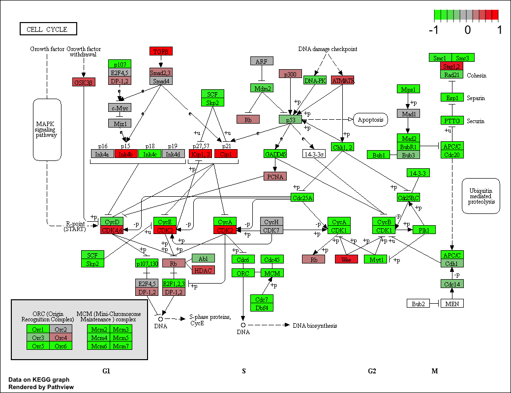

```{r setup, include=FALSE}
knitr::opts_chunk$set(echo = TRUE)
```

Load Files and read files, head done so can check
```{r}
metaFile <- "data/GSE37704_metadata.csv"
countFile <- "data/GSE37704_featurecounts.csv"

# Import metadata and take a peak
colData = read.csv(metaFile, row.names=1)
# head(colData)
# first 3 are control and last 3 are knockdown
countData = read.csv(countFile, row.names=1)
# head(countData)
# countData has extra length column so need to eliminate
# also need to make sure order of rows in colData = order of columns in countData
```

Redefine countData as table but only selecting columns 2:7
```{r}
countData <- as.matrix(countData[,2:7])
# or use [, -1] to get rid of first column
# head(countData)
```

Check that colData and countData matches up
```{r}
all(rownames(colData) == colnames(countData) ) 
```


Also a lot of Zeroes in data so need to remove too
```{r}
# Filter count data where you have 0 read count across all samples.
# use rowSums such that false occurs when = 0
countData = countData[rowSums(countData) != 0, ]
head(countData)
```

How many genes do we have left?
```{r}
nrow(countData)
```

Time to run DESeq2

Load DESeq2 package, eliminate output text so change echo=FALSE
```{r message=FALSE}
library(DESeq2)
```


Run DESeq Analysis, store values in dds
```{r}
dds = DESeqDataSetFromMatrix(countData=countData,
                             colData=colData,
                             design=~condition)
dds = DESeq(dds)
```


Get results and summarize
```{r}
res = results(dds, contrast=c("condition", "hoxa1_kd", "control_sirna"))
summary(res)
```

Volcano Plot
```{r}
plot( res$log2FoldChange, -log(res$padj) )
```

Add some color
```{r}
# Make a color vector for all genes
mycols <- rep("gray", nrow(res) )

# Color red the genes with absolute fold change above 2
mycols[ abs(res$log2FoldChange) > 2 ] <- "red"

# Color blue those with adjusted p-value less than 0.01
#  and absolute fold change more than 2
inds <- (res$pvalue < 0.01) & (abs(res$log2FoldChange) > 2 )
mycols[ inds ] <- "blue"

plot( res$log2FoldChange, -log(res$padj), col=mycols, xlab="Log2(FoldChange)", ylab="-Log(P-value)" )
```

Install packages
```{r eval=FALSE}
source("http://bioconductor.org/biocLite.R")
biocLite("AnnotationDbi")
biocLite("org.Hs.eg.db")
```

Adding Gene Annotation
```{r}
library("AnnotationDbi")
library("org.Hs.eg.db")

columns(org.Hs.eg.db)

res$symbol = mapIds(org.Hs.eg.db,
                    keys=rownames(res), 
                    keytype="ENSEMBL",
                    column="SYMBOL",
                    multiVals="first")

res$entrez = mapIds(org.Hs.eg.db,
                    keys=rownames(res),
                    keytype="ENSEMBL",
                    column="ENTREZID",
                    multiVals="first")

res$name =   mapIds(org.Hs.eg.db,
                    keys=row.names(res),
                    keytype="ENSEMBL",
                    column="GENENAME",
                    multiVals="first")

head(res, 10)
```

Reorder Results and paste to csv file
```{r}
res = res[order(res$pvalue),]
write.csv(res, file="deseq_results.csv")
```

#Section 2: Pathway Analysis

Install package from bioconductor
```{r eval=FALSE}
source("http://bioconductor.org/biocLite.R")
biocLite( c("pathview", "gage", "gageData") )
```

Load packages
```{r}
library("pathview")
library(gage)
library(gageData)

# .hs is for humans
data(kegg.sets.hs)
data(sigmet.idx.hs)

# Focus on signaling and metabolic pathways only
kegg.sets.hs = kegg.sets.hs[sigmet.idx.hs]

# Examine the first 3 pathways
head(kegg.sets.hs, 3)
```

Need Entrez gene identifiers
Gets log fold change values and takes log
```{r}
foldchanges = res$log2FoldChange
names(foldchanges) = res$entrez
head(foldchanges)
```

Gage function to look at results --> look at what is enriched
>Enriched where DEG (Gene Set) intersect w KEGG

```{r}
keggres = gage(foldchanges, gsets=kegg.sets.hs)
```

Look at attributes, can look at them by using head(keggres$greater/less/stats) choose which one to use
```{r}
attributes(keggres)
# ex: head(keggres$less)
```

View Genes mapped on pathway
```{r}
pathview(gene.data=foldchanges, pathway.id="hsa04110")
```



Generate PDF Graph
```{r}
# A different PDF based output of the same data
pathview(gene.data=foldchanges, pathway.id="hsa04110", kegg.native=FALSE)
```


Gene Ontology to look at biologicla processes
```{r}
data(go.sets.hs)
data(go.subs.hs)

# Focus on Biological Process subset of GO
gobpsets = go.sets.hs[go.subs.hs$BP]

gobpres = gage(foldchanges, gsets=gobpsets, same.dir=TRUE)

lapply(gobpres, head)
```


